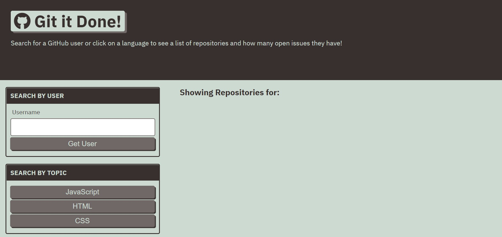

# Git It Done
## Description
An application that uses Github API to allow users to search for repos in an organized manner.  
Built with: 
- HTML
- CSS
- JavaScript
- AJAX
- Server-side APIs

## Link to Deployed Application
https://kaiafay.github.io/git-it-done/

## Mock Up

